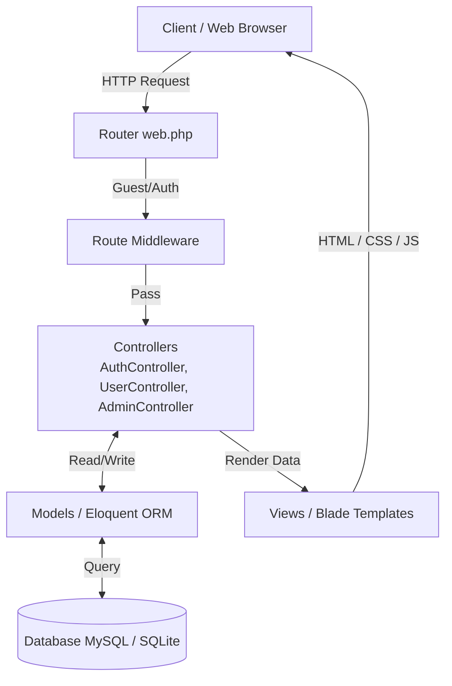

# Psychologia - Aplikasi Web Portal Artikel & Manajemen Informasi Psikologi

## Live Website
Demo aplikasi website dapat langsung diakses melalui link dibawah ini:
* https://301-pixel-vault.infinityfreeapp.com/

## Data Login
* Email : director1@gmail.com
* Password : password

---

## Tentang Aplikasi
**Psychologia** adalah sebuah aplikasi web portal edukatif berbasis Laravel yang berfokus pada publikasi informasi di bidang psikologi. Aplikasi ini dirancang untuk memfasilitasi pembacaan artikel, pengelolaan profil pengguna, serta mempermudah administrator dalam memanajemen anggota dan konten secara terintegrasi.

## Tujuan Aplikasi
Tujuan dari aplikasi Psychologia adalah untuk menyediakan platform terpusat yang mudah diakses bagi masyarakat untuk membaca artikel-artikel edukatif terkait kesehatan mental dan psikologi. Di sisi lain, aplikasi ini juga bertujuan memberikan kemudahan operasional bagi administrator untuk mengelola konten artikel dan data keanggotaan secara efisien melalui dashboard interaktif.

## Fitur Utama
- **Portal Artikel Publik (Landing Page)**: Pengunjung (guest) dapat mengakses Beranda, Hubungi Kami, Katalog Artikel, dan membaca Detail Artikel tanpa perlu mendaftar.
- **Sistem Autentikasi**: Fitur login yang aman untuk mengautentikasi administrator ke dalam sistem.
- **Dashboard Admin**: Panel kontrol terpusat untuk memantau ringkasan sistem dan mengakses pusat bantuan (Help Center).
- **Manajemen Anggota (CRUD)**: Admin memiliki kontrol penuh untuk menambah, melihat, menyunting profil, dan menghapus data anggota (members).
- **Manajemen Artikel (CRUD)**: Fasilitas bagi admin untuk membuat, menyunting, dan menghapus artikel-artikel psikologi.
- **Manajemen Profil Admin**: Kemampuan bagi pengelola aplikasi untuk memperbarui data profil akun admin mereka.

## Arsitektur Sistem
Psychologia dibangun menggunakan pola arsitektur **MVC (Model-View-Controller)** yang merupakan standar dari framework Laravel.

## Sistem Middleware & Proteksi Rute
Aplikasi ini secara ketat memisahkan hak akses menggunakan sistem proteksi rute (Route Protection) dengan Middleware bawaan Laravel:
- **`guest` Middleware**: Diterapkan pada rute autentikasi (`/`, `/login`). Memastikan bahwa hanya pengguna yang belum login yang dapat melihat form login.
- **`auth` Middleware**: Diterapkan pada seluruh rute manajerial (grup rute `/admin/*` dan `/logout`). Memastikan bahwa halaman Dashboard Admin, Manajemen Anggota, dan Manajemen Artikel hanya dapat diakses oleh administrator yang sah. Akses ilegal akan otomatis dialihkan kembali ke form login.
- **Public Routes**: Rute landing page (grup `/landing/*`) dibiarkan terbuka (tanpa middleware pembatasan) agar edukasi psikologi dapat dijangkau oleh khalayak umum.

## Stack Teknologi
- **Backend Framework**: [Laravel 12.0](https://laravel.com/) (PHP ^8.2)
- **Frontend & Styling**: Blade Templates, [Tailwind CSS v4](https://tailwindcss.com/), Vite, JavaScript
- **Interactive UI**: Livewire ^4.3
- **Database**: MySQL / SQLite (dikonfigurasi via `.env`)
- **Text Editor / WYSIWYG**: TinyMCE
- **Asset/Media Management**: ImageKit

## Lisensi
Proyek ini bersifat open-source dan dilisensikan di bawah [MIT License](https://opensource.org/licenses/MIT). Anda bebas menggunakan, memodifikasi, dan mendistribusikan kode sumber aplikasi ini.
